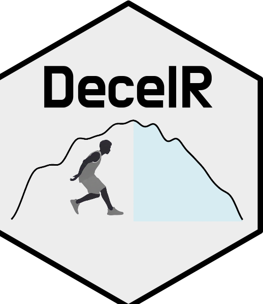

# DecelR



<!-- badges: start -->
<!-- badges: end -->

**DecelR** is an R package for sport scientists to analyze
deceleration performance from
time–speed data, the 
Acceleration-to-Deceleration Assessment (ADA).

The package derives acceleration directly from filtered speed-time
data (dv/dt).

---

## Installation

Install the development version from GitHub:

```r
# install.packages("remotes")
remotes::install_github("NicoPhilipp96/DecelR")
library(DecelR)
run_ada_app()
```
--- 

## Relevant References

1. Harper, D. J., Morin, J.-B., Carling, C., & Kiely, J. (2020). Measuring maximal horizontal deceleration ability using radar technology: reliability and sensitivity of kinematic and kinetic variables. Sports Biomechanics / International Society of Biomechanics in Sports, 1–17.

2. Harper, D. J., Philipp, N. M., Eriksrud, O., Jones, P. A., Graham-Smith, P., & Dos’Santos, T. (2025). Assessing deceleration performance: Methodological and practical considerations. Sports Medicine (Auckland, N.Z.). https://doi.org/10.1007/s40279-025-02339-7

3. West, M. A., Compton, H. R., Dascombe, B. J., & Secomb, J. L. (2025). Introducing the novel deceleration threshold method: Comparative reliability to previous sprint deceleration analysis methods in team-sport athletes. European Journal of Sport Science: EJSS: Official Journal of the European College of Sport Science, 25(4), e12278.
